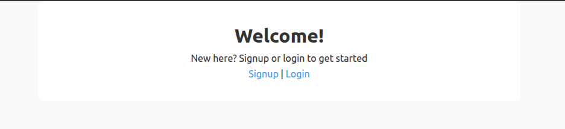
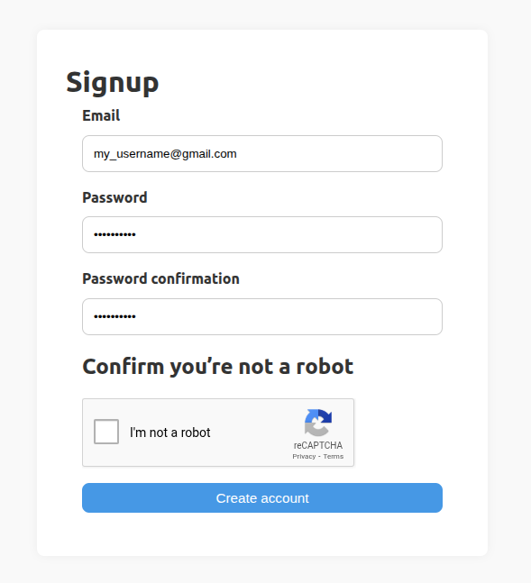
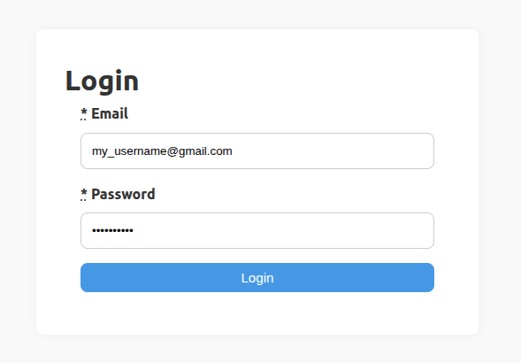
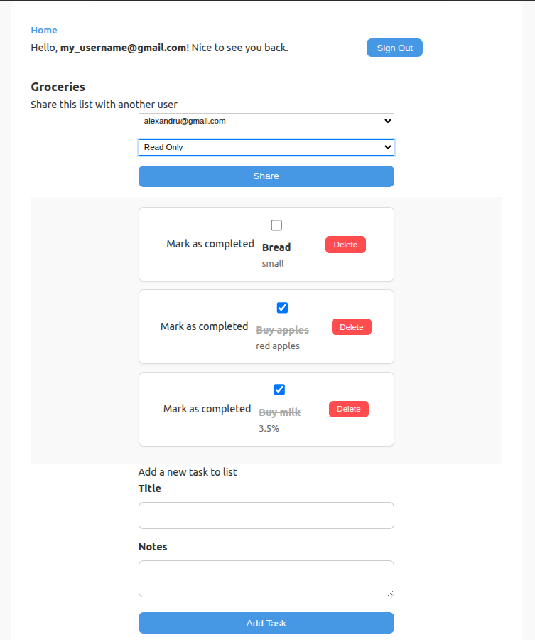
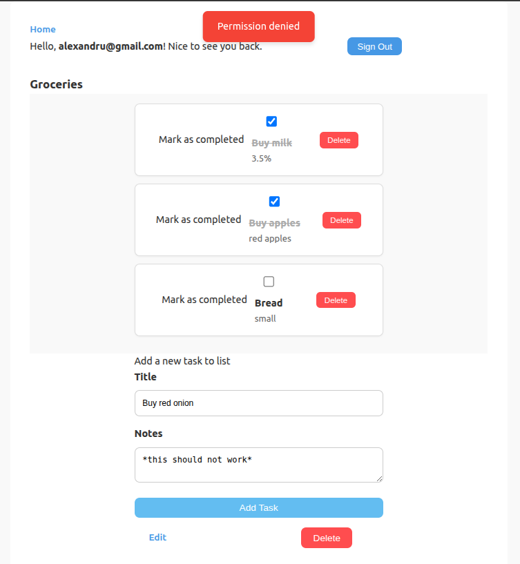

# Todo App

A simple Todo application built with Ruby on Rails, PostgreSQL and Docker.

## Features

- User signup and authentication with Authlogic
- Create, update, and delete todo lists and tasks
- Share todo lists with other users, with read-only or read-write permissions
- reCAPTCHA integration for signup security

## Getting Started

### Prerequisites

- Ruby 3.3.0
- Rails 7.2.x
- PostgreSQL
- Docker & Docker Compose (for containerized setup)

### Setup

1. Clone the repo:

   ```bash
   git clone https://github.com/nagyyalexandru/TODO-App-Ruby.git
   cd todo-app

2. Install dependencies:

    ```bash
    bundle install
    yarn install --check-files

3. Setup database:

    ```bash
    rails db:create db:migrate

4. Use Docker Compose to run the app

    ```bash
    docker compose up --build

5. Open your browser and navigate to http://localhost:3000 (or http://127.0.0.1:3000/)

## Screenshots

### Welcome Page


### Signup Page



### Login page



### Todo Lists View



### Shared List with other User (read-only access)

